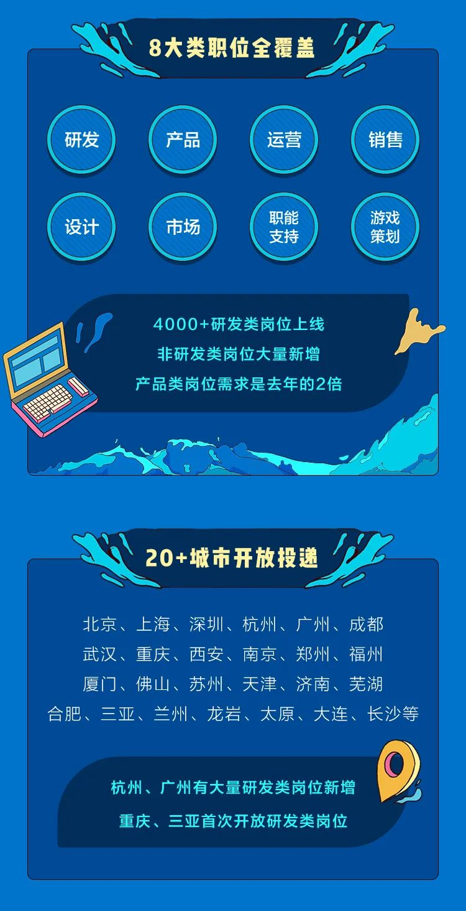

# 【2022秋招】字节跳动2022校招正式拉起帷幕！

> Q:很多小伙伴是不是有疑惑：为啥在2021招聘却叫2022校招？

> A: 解释下这个逻辑：拿22届毕业的同学为例，公司最先给他们开放的是今年春天的21春招-暑期实习（招他们先过来实习，发放实习offer）；然后是[提前批](https://mp.weixin.qq.com/s/J73JMIQpOtddnwEVNE8q3g)；其次是22秋招（目前在做的，直接发校招正式offer）；最后是明年的春招进行补录（尤其针对那些考研失败啊、出国失败啊等等的学生）.总的来说：对于2022年毕业的学生来讲，那则是：21春招->22秋招提前批->22秋招->22春招。

## 前言
本岗位属于字节跳动的校招岗位。

Hello 同学们，

2022校园招聘正式启动！8000+Offer来袭，邀请身边优秀的同学加入公司，一起做有挑战的事！

比之前提前批的4000+研发岗位Offer，翻了一倍，机会又多了很多，赶紧来试试。

## 内推码 8J5ZSB8
+ 字节跳动2022秋季校园招聘已开启，我的内推码👉 8J5ZSB8 
+ 投递链接👉 https://jobs.toutiao.com/s/eorkMPw

## 校招投递前
【松宝写代码】已经内推人数1w+，先别着急投，说点关键的注意点⚠️，花2分钟了解一下：

+ **内推码 8J5ZSB8**，你会在很多地方看到内推码，但一定记得选择能联系上的内推人来跟进进度，不然从秋招锁到来年春招的case也有。用 8J5ZSB8，文末加【松宝写代码】作者微信，避免不必要的损失。
+ **尽早完成投递**，最好是第一周内，历史经验某些岗位光第一周的简历就够面试官面一阵了，后面的投递处理速度会非常慢。
+ **北上深HC数量多**，北上深HC可能比其他地区高了不止一个数量级，离家近的城市竞争压力可能更大。
+ **考虑清楚投递岗位**，面试都是择优的，不要一股脑冲热门岗位，校招只能投2个岗位，想好了再投不能改。
+ **做好笔试准备**，大部分校招岗位都会有笔试，可以网上搜历年笔试题准备，过了笔试就可以开刷面经了。

## 校招投递中
+ 我的内推码👉 8J5ZSB8 
+ 投递链接👉 https://jobs.toutiao.com/s/eohNYt3

下面是详情👇：

## 社招全职/实习生内推投递
（在线岗位即为在招，内推链接进入投递即为内推，同样无笔试哦）

+ 投递链接：https://job.toutiao.com/s/eohRQ1L
+ 也可以扫码投递：

## 【所有内推】进度查询
### 1、自助查询
在PC端打开，**https://job.bytedance.com/society/position/application**

自助查进度可是说是很方便了，毕竟求职的心态「松宝写代码」也体会过，恨不得10分钟看一次进度。

> 整体流程：简历投递=>简历筛选=>简历评估=>评估通过=>笔试中（非必要）=>面试中=>面试已完成=>待入职=>已入职

**当流程中任意一环节挂掉了之后，岗位状态会变成已结束**

简历的几种状态说明：
+ 简历筛选，代表HR初筛ing；
+ 简历评估，代表过了hr初筛，业务评估ing；
+ 评估通过，代表通过了业务评估，可等候通知笔试/面试；
+ 面试中，代表面试ing；
+ 如果出现已结束/已终止，则代表挂了

### 2、联系「松宝写代码」查询
通过「松宝写代码」内推，且如果超1周没有进度更新，加文末「松宝写代码」微信发送【进度催查+名字+岗位】，松宝会帮你联系对应HR催查哦！还可拉入【写代码】研发进阶群，妈妈再也不担心求职字节遇到问题不知道问谁了。

#### 更多优选文章
+ [npm的原理](https://mp.weixin.qq.com/s/PSlUfdX3KGqvXdkC0xQ97w)

+ [快速学习Gulp并接入到项目中（一）](https://mp.weixin.qq.com/s/QQWzNvrXcqq_w3QKKvJagA)

+ [diff算法深入一下？](https://mp.weixin.qq.com/s/HwowUwWA4pkSIQ1J4fwr9w)

#### AB实验

+ [AB实验：MAB多臂老虎机智能调优的基本原理](https://mp.weixin.qq.com/s/7Sz0dSFkWOEo2iw5xrcCLA)

+ [AB实验基础-专有名词](https://mp.weixin.qq.com/s/TXzuf_98yMojVAFlDv0CCQ)

+ [AB实验基础-AB是什么？AB的价值？为什么使用AB实验？](https://mp.weixin.qq.com/s/UcwpNqRQ3we10S9z5cO53g)

#### 每日一题

+ [【每日一题】(58题)算法题：接雨水问题](https://mp.weixin.qq.com/s/OtCI6SjtLCI608LOQMFQ3A)

+ [【每日一题】(57题)数组扁平化的方法有哪些？](https://mp.weixin.qq.com/s/sXIJ6bQj97bZTaYHQgJTIw)

+ [【每日一题】(56题)介绍下深度优先遍历和广度优先遍历，如何实现？](https://mp.weixin.qq.com/s/KkqdB4mWlMgZMcHVhZVZXQ)

#### 总结

+ [2020「松宝写代码」个人年终总结：未来可期](https://mp.weixin.qq.com/s/_ay6KfcC5DMoZu9XqS2NHA)

#### 更多内推
+ [【字节急招】南京-广告算法工程师](https://mp.weixin.qq.com/s/aFCsLiFShaE2pE17NTrOUQ)

+ [【字节急招】深圳-后台开发工程师-Client Infra](https://mp.weixin.qq.com/s/t_WvJuuvwZ2efAiZjKSsdw)

+ [【提前批】「松宝写代码」内推字节跳动2022校招研发提前批](https://mp.weixin.qq.com/s/lKsgF_PlemOdW6TJrVF84w)

+ [【字节急招】多地-前端开发工程师-抖音（北京/深圳/上海/杭州）](https://mp.weixin.qq.com/s/KpWtFVQsUgind9jugevFtg)

+ [【字节急招】多地-前端研发工程师-Data](https://mp.weixin.qq.com/s/1yhT4aon2qXXlcXSK-rbuA)

+ [【字节急招】南京-前端开发工程师—数据可视化](https://mp.weixin.qq.com/s/DY1b53FvcIM5CzbAFpj_Fw)

+ [【汇总】值得关注的内推：字节内推「社招，校招及提前批，实习生」](https://mp.weixin.qq.com/s/J73JMIQpOtddnwEVNE8q3g)

+ 校招内推码：8J5ZSB8

## QA
### Q：1、现在还在走提前批流程的，要不要先投了？还是等走完提前批再说？
> A：先投为敬，因为在流程中的岗位会优先处理的

### Q：2、我需要准备什么？
> A：校招：准备好简历，准备好笔试，准备好面试。社招和实习生：准备好简历，准备好面试。

### Q：3、对于流程还是不清楚？
> A: 加文末「松宝写代码」微信发送【进度催查+名字+岗位】,然后请开始你的提问。

## 感谢支持
> 松宝，「松宝写代码」公众号作者，也用saucxs混迹于江湖，watermark-dom包700+ star，曾在ACM校队，在字节做AB实验，担任面试官，出校招编程题，爱好折腾，致力于全栈，喜欢挑战自己。公众号有精选文章，进阶学习，每日一题，实验室，AB实验，字节内推等模块，欢迎关注和咨询，和松宝一起写代码，冲冲冲！

